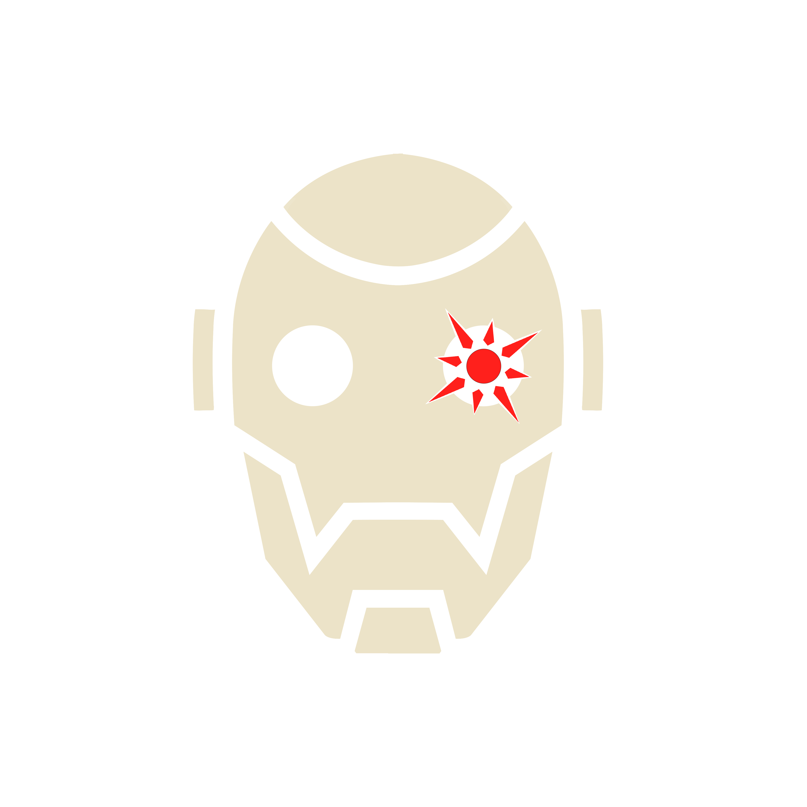

<p align="center">
  
</p>

<h1 align="center">Clankeye</h1>

<p align="center">
  A unified search gateway for collectors — query multiple online marketplaces at once.
</p>

<p align="center">
  
  
  
</p>

---

## Overview

Clankeye aggregates product listings from multiple second-hand and collector marketplaces into one interface. A single search query runs across all enabled platforms, returning a unified, filterable result set — no more switching between tabs.

| Layer | Stack | Port |
|---|---|---|
| **Backend** | Node.js · Express · Crawlee · Playwright | `4000` |
| **Frontend** | React 19 · Vite · MUI · Tailwind CSS | `3000` |

API documentation is available at `http://localhost:4000/swagger`.

---

## Features

- **Unified search** — one query dispatched to all active platforms simultaneously
- **Wishlist** — track items of interest across repeated searches
- **Keyword filter** — exclude results containing unwanted terms
- **Duplicate detection** — identical listings found on multiple platforms are merged
- **Platform health** — real-time status checks for each marketplace connector
- **Swagger UI** — interactive REST API docs at `/swagger`

---

## Supported Platforms

| Platform | Region | Status |
|---|---|---|
| OLX | Portugal | Active |
| eBay | Global | Active |
| Vinted | Global | Active |
| Wallapop | Spain | Active |
| Todocoleccion | Spain | Active |
| Leboncoin | France | Active |
| OLX | Brazil | Active |
| OLX | Poland | Active |

---

## Getting Started

### Prerequisites

- Node.js v16 or later
- npm

### Installation

```bash
git clone https://github.com/yourusername/clankeye.git
cd clankeye

# Backend
cd project-backend && npm install

# Frontend
cd ../project-ui && npm install
```

### Running locally

**Option 1 — unified launcher (Windows)**

From the repository root, starts both servers and streams their output into a single terminal:

```powershell
powershell -ExecutionPolicy Bypass -File .\scripts\start-all.ps1
```

**Option 2 — separate terminals**

```bash
# Terminal 1 — backend
cd project-backend
npm start
# Listening at http://localhost:4000
# Swagger UI at http://localhost:4000/swagger

# Terminal 2 — frontend
cd project-ui
npm start
# Listening at http://localhost:3000
```

---

## Project Structure

```
clankeye/
├── project-backend/
│   ├── controllers/        # Route handlers
│   ├── models/             # Data models
│   ├── platforms/          # Per-platform scrapers and transformers
│   ├── services/           # Business logic (search, deduplication, etc.)
│   ├── utils/              # Shared utilities
│   └── server.js           # Express entry point
├── project-ui/
│   └── src/
│       ├── components/     # Reusable UI components
│       ├── pages/          # Route-level views
│       ├── services/       # API client layer
│       └── contexts/       # React context providers
└── scripts/
    └── start-all.ps1       # Unified dev launcher
```

---

## Testing

```bash
# Backend — full suite
cd project-backend
npm test

# Backend — platform connectors only
npm run test:platforms

# Backend — coverage report
npm run test:coverage

# Frontend
cd project-ui
npm test
```

---

## Disclaimer

Clankeye uses public APIs and web scraping to collect listing data. Some platforms may restrict automated access under their terms of service. This project is intended for **personal and educational use only** and is **not for commercial use**. Review each platform's terms before use and seek proper API access where available.

---

## License

MIT

